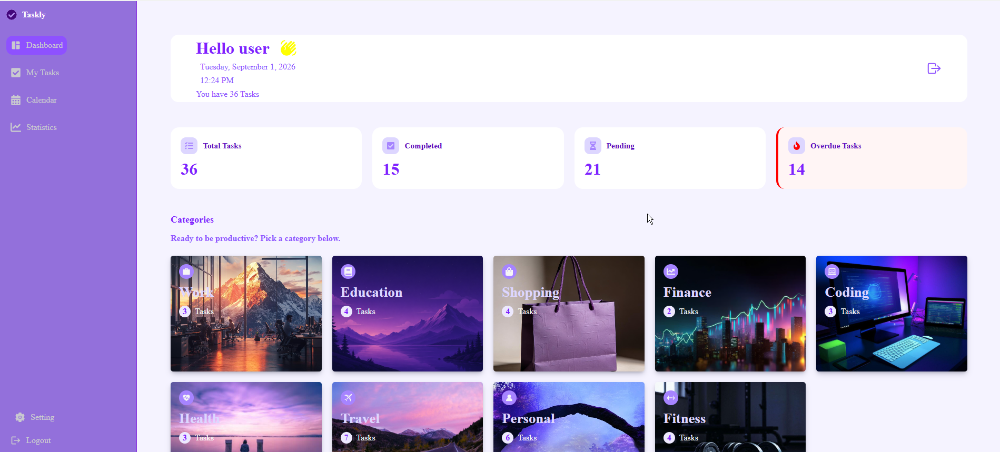
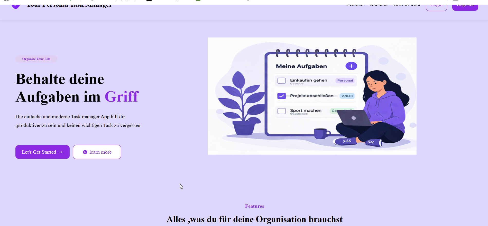
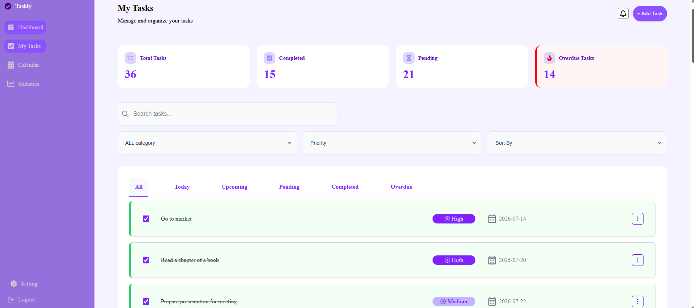
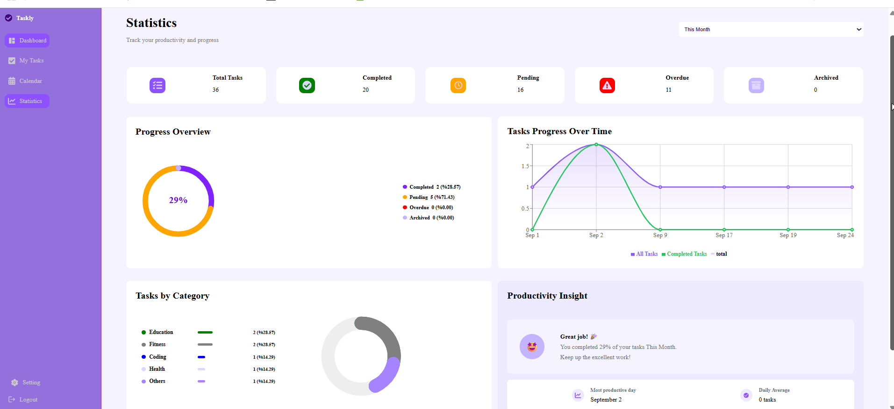
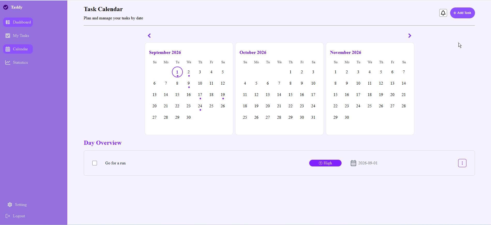

## ToDo App

A modern full-stack ToDo application designed to help users efficiently organize and manage their daily tasks.
## Features

### Dashboard

* Overview of tasks and their current status
* Track pending, completed, and overdue tasks
* Task statistics and data visualization
* Interactive charts

### Task Management

* Create new tasks using a dedicated task form
* Add a task title
* Set task priority
* Set a due date
* Assign tasks to categories
* Edit existing tasks
* Delete tasks
* Mark tasks as completed
* Archive tasks

### Search, Filter & Sort

* Search tasks by name
* Filter tasks by:

  * All
  * Today
  * Upcoming
  * Pending
  * Completed
  * Overdue
* Filter by category
* Filter by priority
* Sort tasks by:

  * Newest
  * Oldest
  * A–Z
  * Due Date

### Authentication

* User registration and login
* JWT-based authentication
* Protected routes
* Secure password hashing

### Backend

* RESTful API built with Node.js and Express
* MongoDB database with Mongoose
* Authentication and authorization
* Task and category management routes
* API controllers and middleware
* CORS configuration
* Environment variable configuration

## Screenshots

Here are some screenshots showcasing the main features and user interface of the ToDo App.

![Dashboard]

![Home Page]

![My Task Page]

![Statistics Page]

![Calendar Page]

## Live Demo

[View Live Demo](https://frontendtodoapp.vercel.app)

👩‍💻 Author
Mahdieh Hajjar

Full-Stack / Frontend Developer

